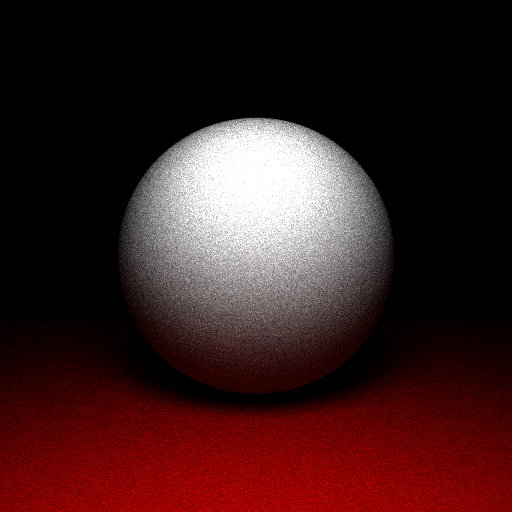
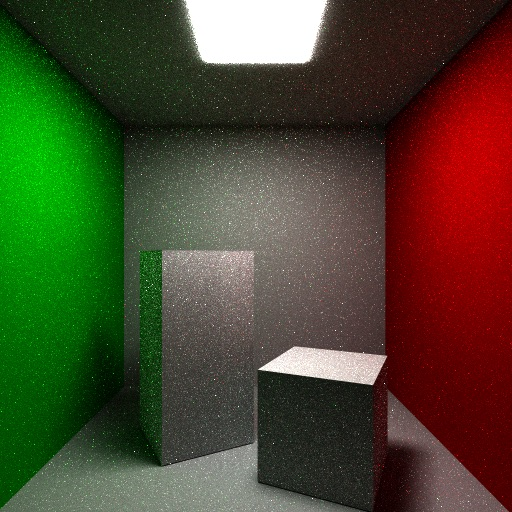
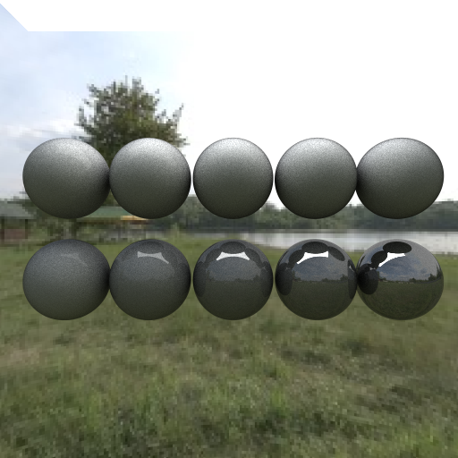
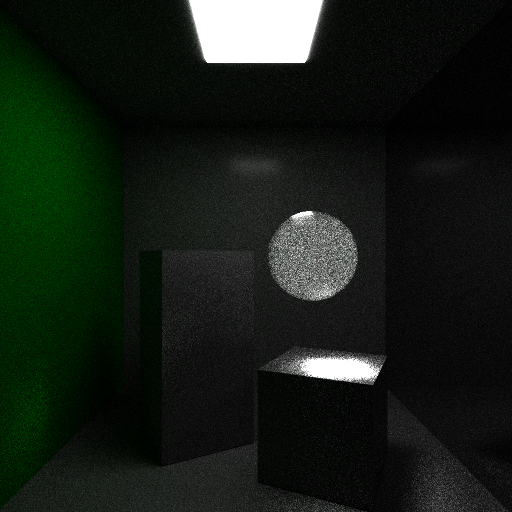

# My Pathtracing Renderer

---

Inspired by Peter Shirley's "Raytracing in a Weekend" books.

  

This renderer is capable of rendering basic primitives and meshes in static scenes with specific BRDF materials, texture mapping, emissive objects, and environment lighting. Images are written as `.ppm` files.

  

### Primitives

The renderer has support for spheres, quads, triangles, and polygon meshes. Each primitive is a type of `hittable` object, with ray intersections implemented for each type. The scene is described as a large list of shared pointers to every `hittable` object, including point and area lights. When an `hittable` is intersected, a `hit_record` struct returns local information such as position, surface normal, uv coordinates, etc.

  

### Materials

The renderer supports glossy, diffuse, and glass materials. Material parameters such as color, Index of Refraction, roughness, metalness, and shading normal are controlled through solid colors or texture maps. The glossy and glass materials use a basic Cook-Torrence microfacet BRDF specular model layered over either the lambertian diffuse model or a refractive model. The fresnel term is an implementation of the Schlick model. The Normal Distribution term is an implementation of GGX. And the Geometric shading term is the Smith Geometric model.

  

### Lights

The renderer supports point lights, area lights, distant "sun-like" lights, and environment lighting. Properties of each light such as color, intensity, size, and direction can be controlled.

  

### Acceleration

The renderer is multithreaded and makes use of a basic Bounding-Volume-Hierarchy. The BVH uses the median split algorithm to divide space, greatly improving render times.

  

### Example Images
   

### Further Work

- The scene description workflow is not robust. Ideally, this would be USD and Hydra enabled.
- Allow for more rendering effects
	- Volumetrics
	- Motion Blur
	- Depth of Field
	- Subdivision surfaces
- Energy conserving materials
- Write to other file types
- GPU enabled
